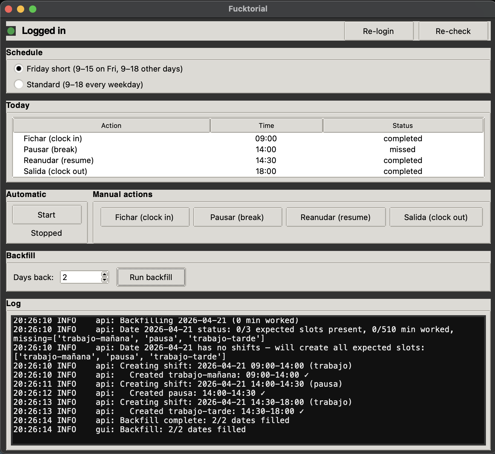

# Fucktorial

> A tiny act of protest against Factorial HR's clock-in UX, disguised as a Python automation.

Factorial is a time-tracking tool that, for reasons that can only be explained by someone being paid per click, requires you to perform roughly **six clicks per "turn"**, and there are **three turns a day** (clock in, pause, resume, clock out). That's ~18 clicks a day, every day, to tell a computer the same thing you told it yesterday.

And because it would be *too easy* to just "fill the whole week on Monday morning," the UI politely refuses to let you edit more than one day at a time. You have to show up. Every. Single. Day. Right at 9:00. And again at 14:00. And again at 14:30. And again at 18:00.

God forbid you go grab lunch, or actually finish work, or — heaven help you — have a meeting that runs over. Miss a turn and now you get to manually backfill it from the web UI, through a modal that opens, closes, re-opens, and asks you to confirm the timezone for some reason.

**Fucktorial clicks the buttons so you don't have to.**



It ships as both a **desktop app** (macOS `.app` / Windows `.exe`) for people who'd rather not touch a terminal, and a **Python CLI** for people who would.

It talks directly to Factorial's GraphQL API (no janky browser automation in the hot path), runs as a quiet little daemon in the background, and does the needful at the scheduled times. It can also **backfill** the past N days when you forgot it existed / were on holiday / your laptop died / you simply refused to participate.

---

## 🚀 One-click run

No Python, no pip, no terminal commands. Clone or download this repo, then double-click:

- **macOS:** `launch-mac.command`
  First run installs Homebrew (if missing), Python 3.12 + Tk, a local `.venv`, dependencies, and Chromium. Every subsequent run launches instantly (~1 second).
  First time only, macOS will warn about an "unidentified developer" — right-click the file → Open → Open.
- **Windows:** `launch-windows.bat`
  First run installs Python 3.12 via `winget` (if missing), creates a venv, installs dependencies, installs Chromium. Subsequent runs launch instantly via `pythonw` (no console window).

The first click of **Log In** inside the app uses [`pycookiecheat`](https://github.com/n8henrie/pycookiecheat) to read your Factorial cookies directly from your everyday Chrome — no bot-check, no extra login. Just be signed into https://app.factorialhr.com in Chrome first.

Prefer prebuilt binaries instead of a launcher script? Grab the latest **`.dmg`** / **`.zip`** from the [Releases page](https://github.com/kikoncuo/Fucktorial/releases) — built by GitHub Actions on every tagged release.

---

## How it works

1. **Cookies** are grabbed from a persistent Playwright Chromium profile (`browser_data/`) that stays logged into Factorial across runs. They're saved to `factorial_cookies.json` and reused for API calls. When the API starts returning 401/403, the script silently reopens the profile, pulls fresh cookies, and retries — **no manual refresh on a schedule**. No password handling, no 2FA dance.
2. The **scheduler** wakes up periodically (every 30s by default), checks the schedule for today, and fires the next pending action if it's due.
3. Each action (`fichar`, `pausar`, `reanudar`, `salida`) is a single GraphQL mutation. It's fast, it's boring, it works.
4. State is kept in `clock_state.json` so you can restart the daemon without double-firing.
5. There's a 30-minute **grace window**: if you were offline when 9:00 hit, it'll still clock you in at 9:17 when your laptop wakes up. Past that window, the action is marked "missed" and the Mac plays a sad sound at you.
6. Holidays and weekends are respected (see `holidays.py`). It won't clock you in on Christmas.

---

## Install — Desktop app (recommended for non-tech users)

Grab the latest build from the [Releases page](https://github.com/kikoncuo/Fucktorial/releases):

- **macOS:** `Fucktorial-macOS.dmg` → open, drag `Fucktorial.app` to `Applications`, launch it. First launch: right-click → Open to bypass Gatekeeper (the app isn't notarised).
- **Windows:** `Fucktorial-Windows.zip` → unzip anywhere, run `Fucktorial.exe`. SmartScreen may complain ("unknown publisher") — click "More info" → "Run anyway".

The first time you click **Log In**, the app will download a Chromium browser (~150 MB) into its local profile. After that it's all local.

### Using the desktop app

1. Click **Log In** → a browser window opens at Factorial. Sign in normally. Click **Log in done**.
2. Pick your schedule: *Friday short* or *Standard*.
3. Hit **Start** to run the daemon. Leave it running in the background.
4. Use the **Manual actions** buttons to fire off a Fichar / Pausar / Reanudar / Salida on demand.
5. Use **Backfill** to fill in missing days (holidays, sick days, "oops I forgot" days).
6. The **Log** panel shows what it's doing. The **Today** panel shows today's plan and what's been done.

---

## Install — CLI (Python)

Requires **Python 3.11+** and **macOS** (for the system sounds — the rest is cross-platform-ish).

```bash
git clone https://github.com/kikoncuo/Fucktorial.git
cd Fucktorial
pip install -r requirements.txt
python -m playwright install chromium
```

Dependencies are:
- `requests` — to talk to the GraphQL endpoint
- `playwright` — only used once in a while to refresh cookies from your browser

The script will `pip install` these itself on first run if they're missing, but do it properly.

---

### Running the GUI from source

**Zero-friction launchers** (no Python setup needed — they bootstrap everything):

- **macOS:** double-click `launch-mac.command`. On first run it installs Homebrew (if missing), a Python with Tk (if missing), a local venv, the deps, and Chromium. On subsequent runs it just launches.
- **Windows:** double-click `launch-windows.bat`. First run installs Python via `winget` (if missing), creates a local venv, installs deps, installs Chromium. Subsequent runs just launch.

If macOS refuses to open `launch-mac.command` because it's "from an unidentified developer", right-click → Open → Open.

**If you already have Python ≥3.11 with Tk:** just run `python gui.py` directly.

---

## One-time setup (CLI)

1. Run the first-time login:

   ```bash
   python main.py --refresh
   ```

   A Chromium window opens against the persistent `browser_data/` profile. Log into Factorial in that window once. Close it. Cookies get saved to `factorial_cookies.json` and the profile stays logged in across runs — so from here on, whenever the API returns 401/403, the script reopens that same profile headlessly and pulls fresh cookies on its own. You should basically never have to run `--refresh` again unless Factorial forces you out of the profile (password change, 2FA, etc.).

2. **Log into Factorial in your regular Chrome** (https://app.factorialhr.com). That's the only prerequisite. Fucktorial reads your cookies directly from Chrome's cookie store via the OS keychain (macOS) or DPAPI (Windows) — no Playwright browser, no Cloudflare bot check, no page load. It auto-detects which Chrome profile (Default / Profile 1 / Profile 2 / …) has the Factorial session and uses that one.

   ```bash
   python main.py --refresh
   ```

   On first macOS run you'll see a Keychain prompt asking to allow access to "Chrome Safe Storage" — click **Always Allow**.

   Fallback for edge cases (Chrome not installed, different browser, etc.):

   ```bash
   python main.py --refresh-browser   # opens a Playwright Chromium you log into once
   ```

3. Edit `config.py` and set `COMPANY_NAME` to whatever your Factorial company is called. It's set to `Laberit Sistemas S.L.` by default because that's where this was written — change it or the company selector page will haunt you.

---

## Running it

### Live / daemon mode (the whole point)

```bash
python main.py                           # default: friday-6h schedule
python main.py --schedule                # same as above, explicit
python main.py --schedule-mode standard  # 9-14, 14:30-18 every weekday
```

The process locks itself via `factorial.lock` so you can't accidentally run two. Leave it running in a terminal, a `tmux` session, a `launchd` plist, a `screen`, a `nohup &`, whatever pleases your operational soul.

### Immediate action

```bash
python main.py --now            # run the next pending action right now
python main.py --force fichar   # clock in NOW, regardless of schedule
python main.py --force pausar   # start break
python main.py --force reanudar # end break
python main.py --force salida   # clock out
```

Useful when you're leaving early, came in late, or just want to prove to yourself the thing works.

### Backfill mode (the redemption arc)

```bash
python main.py --backfill        # fill the last 7 days
python main.py --backfill 14     # fill the last 14 days
python main.py --backfill 30     # you hedonist
```

It walks each workday backwards, skips weekends and holidays, skips days that already have shifts, and posts the expected slots (full day, or `09:00–15:00` on Fridays in `friday-6h` mode). Came back from a week off and Factorial is glaring at you? `--backfill 10` and go make coffee.

### Cookie refresh (rarely needed)

```bash
python main.py --refresh
```

Only needed for the initial login, or if the persistent browser profile gets kicked out (e.g. password change, 2FA re-prompt, you deleted `browser_data/`). In normal operation the script auto-refreshes cookies on 401/403 — you don't need to babysit this.

---

## Settings

All in `config.py`:

| Setting | What it does |
|---|---|
| `DEFAULT_SCHEDULE` | The standard weekday shape: `fichar 09:00 · pausar 14:00 · reanudar 14:30 · salida 18:00` |
| `FRIDAY_SCHEDULE_6H` | Friday short day: `fichar 09:00 · salida 15:00` |
| `DEFAULT_SCHEDULE_MODE` | `friday-6h` (default) or `standard` |
| `STANDARD_SHIFT_SLOTS` / `FRIDAY_SHIFT_SLOTS_6H` | What backfill posts |
| `GRACE_WINDOW_MINUTES` | How late an action can still fire (default `30`) |
| `SLEEP_INTERVAL_SECONDS` | Scheduler poll interval (default `30`) |
| `TIMEZONE` | `Europe/Madrid` — change if you work elsewhere |
| `COMPANY_NAME` | Your Factorial tenant name |
| `BREAK_CONFIGURATION_ID` | The `break_configuration_id` captured from a real session. If breaks stop registering, re-capture this from DevTools → Network. |
| `SOUND_*` | macOS system sounds for login-needed / completed / missed / failed |

---

## Files it writes

- `factorial_cookies.json` — your session. **Do not commit this.**
- `clock_state.json` — what's been done today.
- `factorial.log` — every decision it made, for when you want to prove it's the script's fault.
- `factorial.lock` — mutex; delete only if you're sure nothing's running.
- `browser_data/` — Playwright's persistent Chromium profile, so you don't re-login constantly.
- `local_holidays.json` (optional) — extra holidays beyond the built-in list.

---

## FAQ

**Is this against the Factorial ToS?**
Probably. It's also against my will to click the same button 90 times a week. We all have our crosses to bear.

**Will I get fired?**
If your manager is me or is a contributor to this project, no — this is sanctioned, please stop clicking 90 buttons a week on their behalf and go do actual work. If your manager is anyone else: I have absolutely no idea, good luck out there.

**Why can't I just edit the whole week in one go in Factorial's UI?**
Excellent question. Please forward it to Factorial.

**Why the name?**
It wrote itself.

---

## Building the desktop app yourself

```bash
pip install pyinstaller==6.10.0
python -m playwright install chromium
pyinstaller --noconfirm --clean fucktorial.spec
```

Output lands in `dist/` — `Fucktorial.app` on macOS, `Fucktorial/Fucktorial.exe` on Windows. The `.github/workflows/build.yml` workflow does this in CI and attaches the artefacts to a GitHub Release on every `v*` tag.

---

## Disclaimer

This is a personal automation script that performs actions you're allowed to perform manually. It logs actual hours; it doesn't forge them. Use it responsibly, don't clock in for shifts you didn't work, and don't blame me when Factorial changes their GraphQL schema and everything breaks on a Tuesday morning.
